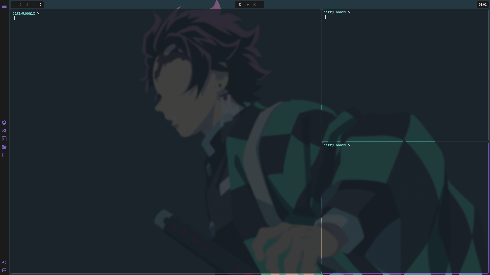

🐧 Loonix Linux

Welcome to my configuration repository! This repo contains my personal Arch Linux dotfiles, crafted with a focus on clean aesthetics and a fast, efficient workflow.



## 🛠️ TECH STACK
 - WM: Hyprland (Wayland)
 - Terminal: Kitty
 - Shell: Zsh
 - Browser: Brave
 - File Manager: Thunar
 - Text Editor: Micro
 - Bootloader: Limine
 - login page: sddm

***

## 🚀 QUICK INSTALLATION
If you're feeling brave (use at your own risk!), simply clone and copy the configs:

    git clone https://github.com/citzeye/loonix.git
    cd loonix
    chmod +x loonix.sh
    ./loonix.sh


> ## Note :
> *I asume you have been installed ARCH base with no GUI.* This is online install not offline. Thats mean you need INTERNET CONNECTION.
> You can use usb tethering from your phone too.
>
> Test your connection with : ping google.com" (press 'ctrl+c' to stop
> ping)
>
> IMPORTANT : MASTER config playground in ```~/loonix/.config```
> Always use aliase ```deploy``` after edit to send all your config into the right position.

***

## ⌨️ Keybindings
| Category | Keybind | Function |
| :--- | :--- | :--- |
| Apps | Super + Enter | Terminal (Kitty) |
| Apps | Super + B | Browser (Brave) |
| Apps | Super + E | File Manager (Thunar) |
| Apps | Super + Space | App Launcher (Wofi) |
| Apps | Super + V | Clipboard History |
| Window | Alt + Q | Close Window (Kill) |
| Window | Super + T | Toggle Floating |
| Window | Super + F | Fullscreen |
| Window | Super + Arrow | Move Focus |
| System | Super + M | Exit Hyprland |
| System | Super + Home | Reload All Configs |
| System | Ctrl + Shift + R | Total Re-Load |
| Screen | Super + Print | Screenshot Region |
| Screen | Print | Screenshot Fullscreen |
| Workspc | Alt + [1-5] | Switch Workspace |
| Workspc | Super + [1-5] | Move Window to Workspace |
| Workspc | Alt + Tab | Next Workspace - Loop |

***

## ⚡ Essential Aliases
| Alias | File to Edit |
| :--- | :--- |
| chypr | Hyprland Main Config |
| ckeybinds| Keybindings Config |
| czsh | Zsh Runtime Config |
| ckit | Kitty Terminal Config |

***

## 🛠️ System & Workflow
| Alias | Function |
| :--- | :--- |
| nuke | TOTAL REFRESH: Reload Zsh + Reset All GUI |
| rzsh | Reload Zsh Only |
| gitpush| Auto Add, Commit ("update"), & Push |
| c | Jump to ~/.config |
| deploy | Send All Config into hyprland system |
| update | Update System (pacman -Syu) |
| spi / spr| Install / Remove Package |
| dsync | Sync script for .desktop files |

***

Built with ☕ and the **headache**, hahahahaha.

