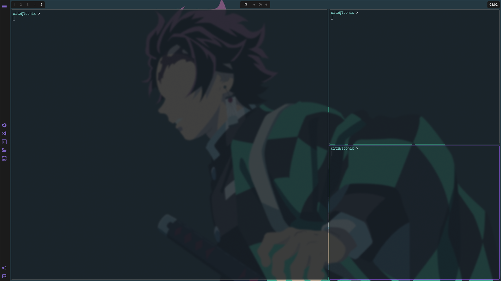
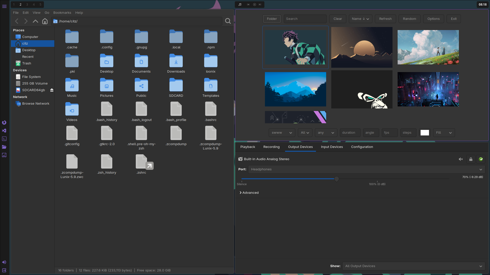

🐧 Loonix Linux

Welcome to my configuration repository! This repo contains my personal Arch Linux dotfiles, crafted with a focus on clean aesthetics and a fast, efficient workflow.

## 🛠️ TECH STACK
 - WM: Hyprland (Wayland)
 - Terminal: Kitty
 - Shell: Zsh | Loonix Breadcrumb  loonix citz loonix .config go  
 - Browser: Brave
 - File Manager: Thunar
 - Text Editor: VsCode / Micro
 - Bootloader: Limine
 - login page: Loonix-login

***

## 🚀 QUICK INSTALLATION
If you're feeling brave (use at your own risk!), simply clone and copy the configs:

    git clone https://github.com/citzeye/loonix.git
    cd loonix
    chmod +x loonix.sh
    ./loonix.sh

> ## Note :
> *I asume you have been installed ARCH base with no GUI.* This is online install not offline. Thats mean you need INTERNET CONNECTION.
> You can use usb tethering from your phone too.
>
> Test your connection with : ping google.com" (press 'ctrl+c' to stop
> ping)
>
> ISO : coming soon

***

## ⌨️ Keybindings
| Category | Keybind | Function |
| :--- | :--- | :--- |
| Apps | Super + Enter | Terminal (Kitty) |
| Apps | Super + B | Browser (Brave) |
| Apps | Super + E | File Manager (Thunar) |
| Apps | Super + Space | App Launcher (Wofi) |
| Apps | Super + V | Clipboard History |
| Apps | Super + W | Auto Change Wallpaper / Or click image logo on leftbar |
| Window | Alt + Q | Close Window (Kill) |
| Window | Super + T | Toggle Floating |
| Window | Super + F | Fullscreen |
| Window | Super + Arrow or Vim Mode HJKL | Move Focus |
| System | Super + M | Power Menu |
| System | Super + Home | ☢️ THE "NUKE & RELOAD" Reload All Configs |
| Screen | Super + Print | Screenshot Region |
| Screen | Print | Screenshot Fullscreen |
| Workspc | Alt + [1-5] | Switch Workspace |
| Workspc | Super + [1-5] | Move Window to Workspace |
| Workspc | Alt + Tab | Next Workspace - Loop |

***

> ## Note :
> Use "Loonix" Folder as a workspace playground if you want to edit something. This folder already connect to ".config" and other important file to.

## ⚡ Essential Hyprland Aliases
| Alias | File to Edit |
| :--- | :--- |
| , | clear terminal |
| chypr | Hyprland Main Config |
| cexec| exec Config |
| cenv| environtment Config |
| crules| windows rule Config |
| ckeybinds| Keybindings Config |
| ccolors| Hyprland color Config |
| cidle| Hypridle Config |
| clock| Hyprlock Config |
| cpaper| Hyprpaper Config |
| czsh | Zsh Runtime Config |
| ckit | Kitty Terminal Config |
| cway | waybar panel Config |
| cwaycss | waybar css Config |

***

## 🛠️ Loonix System & Workflow
| Alias | Function |
| :--- | :--- |
| nuke | TOTAL REFRESH: All GUI |
| rzsh | Source Zsh Only |
| nz | Reload nuke and rzsh |
| gogit| Auto Add, Commit ("update"), & Push |
| c | Jump to ~/.config |
| l | Jump to ~/loonix |
| s | Jump to ~/loonix/.config/scripts |
| t | Jump to ~/loonix/tools |
| z | Jump to ~/home/user |
| update | Update System (pacman -Syu) |
| spi / spr| Pacman Install / Remove Package |
| yi / yr| Yay Install / Remove Package |
***

Built with ☕ and the **headache**, hahahahaha.

